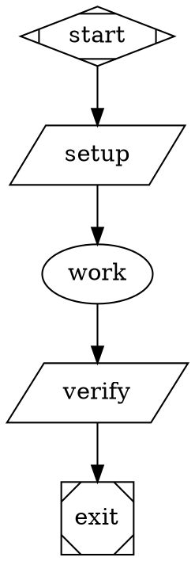
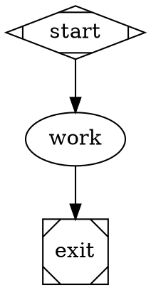

# Sandbox Real-Agent Smoke QA Plan

## Purpose

Manually smoke test the `add-acp-backend` branch with real LLM-backed agents across the full sandbox/agent matrix:

| Sandbox provider | Claude | Codex | Gemini |
| --- | --- | --- | --- |
| Local | Required | Required | Required |
| Docker | Required | Required | Required |
| Daytona | Required | Required | Required |

The key branch constraint is intentional: ACP requires bidirectional raw stdio and is supported by local and Docker in this cutover, but not by Daytona. This QA plan proves ACP works through local and Docker sandboxes for Claude, Codex, and Gemini; uses Daytona CLI execution for the same three agents as the positive Daytona coverage; and finally verifies ACP-on-Daytona fails clearly instead of falling back to host execution or PTY transport.

## Scope

In scope:

- A real Claude ACP-backed agent running through the local sandbox provider with no container.
- A real Codex ACP-backed agent running through the local sandbox provider with no container.
- A real Gemini ACP-backed agent running through the local sandbox provider with no container.
- A real Claude ACP-backed agent running in a Docker sandbox.
- A real Codex ACP-backed agent running in a Docker sandbox.
- A real Gemini ACP-backed agent running in a Docker sandbox.
- A real Claude CLI-backed agent running in a Daytona sandbox.
- A real Codex CLI-backed agent running in a Daytona sandbox.
- A real Gemini CLI-backed agent running in a Daytona sandbox.
- Optional Daytona API backend control coverage after the required 3x3 matrix.
- An ACP-backed node on Daytona returning the expected unsupported-provider failure.
- Evidence capture through `inspect`, `events`, `dump`, and optional preserved-sandbox SSH.

Out of scope:

- Automated nextest coverage.
- ACP positive execution on Daytona.
- Full regression of Docker or local ACP behavior beyond this real-agent smoke.
- Snapshot creation performance tuning beyond what is needed to run the smoke.

## Preconditions

- Current branch is `add-acp-backend`.
- Local host has Node/npx available for the no-container ACP smoke.
- Docker is available for the Docker sandbox smoke.
- Daytona API key is available with sandbox/snapshot scopes.
- Real LLM credentials are available for all three required agents.
- GitHub access is configured if the operator chooses not to use `skip_clone = true`.
- Network access from the host, Docker container, and Daytona sandbox allows installing CLI packages.

Recommended environment:

```bash
cargo build -p fabro-cli
export FABRO=./target/debug/fabro

set -a
source .env
set +a

$FABRO doctor -v
```

Required environment variables for the full matrix:

- `DAYTONA_API_KEY`
- `ANTHROPIC_API_KEY`
- `OPENAI_API_KEY`
- `GEMINI_API_KEY`

## Test Data Setup

Create a scratch directory for manual smoke files:

```bash
mkdir -p smoke tmp
```

Docker and Daytona smoke configs use `skip_clone = true` to avoid depending on pushed branch state. This keeps the test focused on runtime behavior and real agent execution. The local smoke intentionally runs directly in the current working tree because `provider = "local"` has no container boundary; remove `smoke_local_acp_*_result.txt`, `.fabro-smoke-*-acp`, and `.fabro-smoke-home/` during cleanup if they remain.

Agent definitions for the required matrix:

| Agent | Provider | Model | Credential | ACP command | Daytona CLI install |
| --- | --- | --- | --- | --- | --- |
| Claude | `anthropic` | `claude-haiku-4-5` | `ANTHROPIC_API_KEY` | `npx -y @zed-industries/claude-code-acp@latest` | `npm install -g @anthropic-ai/claude-code`; binary: `claude` |
| Codex | `openai` | `gpt-5.3-codex` | `OPENAI_API_KEY` | `npx -y @zed-industries/codex-acp@latest` | `npm install -g @openai/codex`; binary: `codex` |
| Gemini | `gemini` | `gemini-3.1-pro-preview` | `GEMINI_API_KEY` | `npx -y -- @google/gemini-cli@latest --experimental-acp` | `npm install -g @google/gemini-cli`; binary: `gemini` |

## Smoke 1: Local ACP Backend Matrix

### Goal

Prove real Claude, Codex, and Gemini ACP-backed agents can run through the local sandbox provider without a container, use bidirectional raw stdio, and mutate the local workflow filesystem.

Required local combinations:

| Agent | Workflow | Result file | Expected content |
| --- | --- | --- | --- |
| Claude | `smoke/local_acp_claude.toml` | `smoke_local_acp_claude_result.txt` | `local-acp-claude-ok` |
| Codex | `smoke/local_acp_codex.toml` | `smoke_local_acp_codex_result.txt` | `local-acp-codex-ok` |
| Gemini | `smoke/local_acp_gemini.toml` | `smoke_local_acp_gemini_result.txt` | `local-acp-gemini-ok` |

### Files

Create one graph per agent. The Claude graph is:



Create matching Codex and Gemini graphs with these substitutions:

| Agent | Graph file | Provider | Model | ACP wrapper | Result file | Expected content |
| --- | --- | --- | --- | --- | --- | --- |
| Codex | `smoke/local_acp_codex.fabro` | `openai` | `gpt-5.3-codex` | `.fabro-smoke-codex-acp` | `smoke_local_acp_codex_result.txt` | `local-acp-codex-ok` |
| Gemini | `smoke/local_acp_gemini.fabro` | `gemini` | `gemini-3.1-pro-preview` | `.fabro-smoke-gemini-acp` | `smoke_local_acp_gemini_result.txt` | `local-acp-gemini-ok` |

Create `smoke/local_acp_claude.toml`:

```toml
_version = 1

[workflow]
graph = "local_acp_claude.fabro"

[run.sandbox]
provider = "local"

[[run.prepare.steps]]
script = '''
set -eu
NODE_DIR="$(dirname "$(command -v node)")"
NPX_PATH="$(command -v npx)"
cat > .fabro-smoke-claude-acp <<SH
set -eu
export HOME="\${HOME:-\$PWD/.fabro-smoke-home}"
mkdir -p "\$HOME"
export PATH="$NODE_DIR:/usr/local/bin:/usr/bin:/bin:\${PATH:-}"
exec "$NPX_PATH" -y @zed-industries/claude-code-acp@latest
SH
chmod +x .fabro-smoke-claude-acp
'''
```

Create matching Codex and Gemini TOML files:

- `smoke/local_acp_codex.toml` uses `graph = "local_acp_codex.fabro"`, writes `.fabro-smoke-codex-acp`, and the wrapper ends with `exec "$NPX_PATH" -y @zed-industries/codex-acp@latest`.
- `smoke/local_acp_gemini.toml` uses `graph = "local_acp_gemini.fabro"`, writes `.fabro-smoke-gemini-acp`, and the wrapper ends with `exec "$NPX_PATH" -y -- @google/gemini-cli@latest --experimental-acp`.

### Run

```bash
$FABRO run --auto-approve smoke/local_acp_claude.toml
$FABRO run --auto-approve smoke/local_acp_codex.toml
$FABRO run --auto-approve smoke/local_acp_gemini.toml
```

### Pass Criteria

- Each of the three local runs exits successfully.
- Each `verify` stage prints its expected `local-acp-<agent>-ok` content.
- `fabro events <run-id> --tail 200` for each run includes:
  - `agent.acp.started`
  - `agent.acp.completed`
  - `stage.completed` for `work`
  - `stage.completed` for `verify`
- Events for each run do not include `agent.session.activated` for the `work` stage.
- Events for each run do not include `agent.cli.started` for the `work` stage.
- `fabro inspect <run-id>` shows each run succeeded.
- The local working tree contains each expected `smoke_local_acp_<agent>_result.txt` file with exactly the expected content.

### Failure Notes

- Missing `node` or `npx` on the host is a setup failure for this no-container smoke.
- A successful run with API or CLI events instead of ACP events is a branch failure because ACP silently fell back to another backend.
- The local provider writes directly into the current working tree; check `git status` before cleanup.

## Smoke 2: Docker ACP Backend Matrix

### Goal

Prove real Claude, Codex, and Gemini ACP-backed agents can run inside Docker sandboxes, use bidirectional non-PTY stdio through Docker exec, and mutate only the container workspace.

Required Docker combinations:

| Agent | Workflow | Result file | Expected content |
| --- | --- | --- | --- |
| Claude | `smoke/docker_acp_claude.toml` | `smoke_docker_acp_claude_result.txt` | `docker-acp-claude-ok` |
| Codex | `smoke/docker_acp_codex.toml` | `smoke_docker_acp_codex_result.txt` | `docker-acp-codex-ok` |
| Gemini | `smoke/docker_acp_gemini.toml` | `smoke_docker_acp_gemini_result.txt` | `docker-acp-gemini-ok` |

### Files

Create one graph per agent. The Claude graph is:


Create matching Codex and Gemini graphs with these substitutions:

| Agent | Graph file | Provider | Model | ACP wrapper | Result file | Expected content |
| --- | --- | --- | --- | --- | --- | --- |
| Codex | `smoke/docker_acp_codex.fabro` | `openai` | `gpt-5.3-codex` | `.fabro-smoke-codex-acp` | `smoke_docker_acp_codex_result.txt` | `docker-acp-codex-ok` |
| Gemini | `smoke/docker_acp_gemini.fabro` | `gemini` | `gemini-3.1-pro-preview` | `.fabro-smoke-gemini-acp` | `smoke_docker_acp_gemini_result.txt` | `docker-acp-gemini-ok` |

Create `smoke/docker_acp_claude.toml`:

```toml
_version = 1

[workflow]
graph = "docker_acp_claude.fabro"

[run.sandbox]
provider = "docker"
preserve = true

[run.sandbox.docker]
image = "buildpack-deps:noble"
network_mode = "bridge"
memory_limit = "4GB"
cpu_quota = 200000
skip_clone = true

[[run.prepare.steps]]
script = '''
set -eu
mkdir -p "$HOME/.local"
if ! command -v node >/dev/null 2>&1; then
  curl -fsSL https://nodejs.org/dist/v22.14.0/node-v22.14.0-linux-x64.tar.gz | tar -xz --strip-components=1 -C "$HOME/.local"
fi
export PATH="$HOME/.local/bin:$PATH"
npm --version
npx --version
NODE_DIR="$(dirname "$(command -v node)")"
NPX_PATH="$(command -v npx)"
cat > .fabro-smoke-claude-acp <<SH
set -eu
export HOME="\${HOME:-\$PWD/.fabro-smoke-home}"
mkdir -p "\$HOME"
export PATH="$NODE_DIR:/usr/local/bin:/usr/bin:/bin:\${PATH:-}"
exec "$NPX_PATH" -y @zed-industries/claude-code-acp@latest
SH
chmod +x .fabro-smoke-claude-acp
'''
```

Create matching Codex and Gemini TOML files:

- `smoke/docker_acp_codex.toml` uses `graph = "docker_acp_codex.fabro"`, writes `.fabro-smoke-codex-acp`, and the wrapper ends with `exec "$NPX_PATH" -y @zed-industries/codex-acp@latest`.
- `smoke/docker_acp_gemini.toml` uses `graph = "docker_acp_gemini.fabro"`, writes `.fabro-smoke-gemini-acp`, and the wrapper ends with `exec "$NPX_PATH" -y -- @google/gemini-cli@latest --experimental-acp`.

### Run

```bash
$FABRO run --auto-approve smoke/docker_acp_claude.toml
$FABRO run --auto-approve smoke/docker_acp_codex.toml
$FABRO run --auto-approve smoke/docker_acp_gemini.toml
```

### Pass Criteria

- Each of the three Docker runs exits successfully.
- Each `verify` stage prints its expected `docker-acp-<agent>-ok` content.
- `fabro events <run-id> --tail 200` for each run includes:
  - `sandbox.ready`
  - `setup.started`
  - `setup.completed`
  - `agent.acp.started`
  - `agent.acp.completed`
  - `stage.completed` for `verify`
- Events for each run do not include `agent.session.activated` for the `work` stage.
- Events for each run do not include `agent.cli.started` for the `work` stage.
- `fabro inspect <run-id>` shows each run succeeded.
- Each preserved Docker sandbox contains its expected `smoke_docker_acp_<agent>_result.txt` file with exactly the expected content.

### Failure Notes

- Docker daemon, image pull, or package-install failures are setup failures unless the error indicates ACP stdio or sandbox routing broke.
- A successful run with API or CLI events instead of ACP events is a branch failure because ACP silently fell back to another backend.

## Smoke 3: Daytona API Backend Control

### Goal

Optionally prove a real provider API agent can use Fabro-managed tools inside the Daytona sandbox and mutate the sandbox filesystem. This is a backend control smoke, not part of the required 3x3 external-agent matrix.

### Files

Create `smoke/daytona_api.fabro`:


Create `smoke/daytona_api.toml`:

```toml
_version = 1

[workflow]
graph = "daytona_api.fabro"

[run.sandbox]
provider = "daytona"
preserve = true

[run.sandbox.daytona]
skip_clone = true
auto_stop_interval = 60
```

### Run

```bash
$FABRO run --auto-approve smoke/daytona_api.toml
```

### Pass Criteria

- Run exits successfully.
- The `verify` stage prints `daytona-api-ok`.
- `fabro events <run-id> --tail 200` includes:
  - `sandbox.ready`
  - `agent.session.activated`
  - `stage.completed` for `work`
  - `stage.completed` for `verify`
- `fabro inspect <run-id>` shows the run succeeded.

### Failure Notes

- Provider authentication failures are setup failures unless the error indicates sandbox routing or missing Daytona state.
- Missing `smoke_api_result.txt` after a successful agent stage is a failure.

## Smoke 4: Daytona CLI Backend Matrix

### Goal

Prove the branch runs real Claude, Codex, and Gemini external CLI agents inside Daytona when the CLI is preinstalled by the workflow environment. This also confirms Fabro no longer installs CLIs implicitly at stage runtime.

Required Daytona combinations:

| Agent | Workflow | Result file | Expected content | CLI binary |
| --- | --- | --- | --- | --- |
| Claude | `smoke/daytona_cli_claude.toml` | `smoke_daytona_cli_claude_result.txt` | `daytona-cli-claude-ok` | `claude` |
| Codex | `smoke/daytona_cli_codex.toml` | `smoke_daytona_cli_codex_result.txt` | `daytona-cli-codex-ok` | `codex` |
| Gemini | `smoke/daytona_cli_gemini.toml` | `smoke_daytona_cli_gemini_result.txt` | `daytona-cli-gemini-ok` | `gemini` |

### Files

Create one graph per agent. The Claude graph is:


Create matching Codex and Gemini graphs with these substitutions:

| Agent | Graph file | Provider | Model | Result file | Expected content |
| --- | --- | --- | --- | --- | --- |
| Codex | `smoke/daytona_cli_codex.fabro` | `openai` | `gpt-5.3-codex` | `smoke_daytona_cli_codex_result.txt` | `daytona-cli-codex-ok` |
| Gemini | `smoke/daytona_cli_gemini.fabro` | `gemini` | `gemini-3.1-pro-preview` | `smoke_daytona_cli_gemini_result.txt` | `daytona-cli-gemini-ok` |

Create `smoke/daytona_cli_claude.toml`:

```toml
_version = 1

[workflow]
graph = "daytona_cli_claude.fabro"

[run.sandbox]
provider = "daytona"
preserve = true

[run.sandbox.daytona]
skip_clone = true
auto_stop_interval = 60

[[run.prepare.steps]]
script = '''
set -eu
mkdir -p "$HOME/.local"
if ! command -v node >/dev/null 2>&1; then
  curl -fsSL https://nodejs.org/dist/v22.14.0/node-v22.14.0-linux-x64.tar.gz | tar -xz --strip-components=1 -C "$HOME/.local"
fi
export PATH="$HOME/.local/bin:$PATH"
npm config set prefix "$HOME/.local"
command -v claude >/dev/null 2>&1 || npm install -g @anthropic-ai/claude-code
claude --version
'''
```

Create matching Codex and Gemini TOML files:

- `smoke/daytona_cli_codex.toml` uses `graph = "daytona_cli_codex.fabro"`, installs `@openai/codex` when `codex` is missing, and prints `codex --version`.
- `smoke/daytona_cli_gemini.toml` uses `graph = "daytona_cli_gemini.fabro"`, installs `@google/gemini-cli` when `gemini` is missing, and prints `gemini --version`.

### Run

```bash
$FABRO run --auto-approve smoke/daytona_cli_claude.toml
$FABRO run --auto-approve smoke/daytona_cli_codex.toml
$FABRO run --auto-approve smoke/daytona_cli_gemini.toml
```

### Pass Criteria

- Each of the three Daytona CLI runs exits successfully.
- Each `verify` stage prints its expected `daytona-cli-<agent>-ok` content.
- `fabro events <run-id> --tail 200` for each run includes:
  - `setup.started`
  - `setup.completed`
  - `agent.cli.started`
  - `agent.cli.completed`
  - `stage.completed` for `verify`
- Events for each run do not include new `cli.ensure.started`, `cli.ensure.completed`, or `cli.ensure.failed` entries for this branch's runtime path.
- Each preserved Daytona sandbox contains its expected `smoke_daytona_cli_<agent>_result.txt` file with exactly the expected content.

### Failure Notes

- `CLI backend requires '<binary>' to be installed in the sandbox PATH` means the prepare step did not install the agent CLI where the backend expects it. Treat this as environment/setup failure unless the prepare logs prove `claude`, `codex`, or `gemini` was installed in `$HOME/.local/bin`.
- CLI package-install failures may be caused by Daytona network policy or npm registry availability.

## Smoke 5: Daytona ACP Backend Expected Unsupported Failure

### Goal

Prove ACP on Daytona fails explicitly because Daytona lacks bidirectional raw stdio support. This provider-boundary check is run once with Claude because the failure must happen before any agent-specific command is launched. This test guards against unsafe fallbacks such as running ACP on the host or over a PTY.

### Files

Create `smoke/daytona_acp_unsupported.fabro`:



Create `smoke/daytona_acp_unsupported.toml`:

```toml
_version = 1

[workflow]
graph = "daytona_acp_unsupported.fabro"

[run.sandbox]
provider = "daytona"
preserve = true

[run.sandbox.daytona]
skip_clone = true
auto_stop_interval = 60
```

### Run

```bash
$FABRO run --auto-approve smoke/daytona_acp_unsupported.toml
```

### Pass Criteria

- Run fails.
- The failure text contains:
  - `ACP backend requires bidirectional stdio`
  - `Daytona sandbox provider does not support it yet`
- Events include `agent.acp.started`.
- Events do not include `agent.acp.completed`.
- The preserved Daytona sandbox does not contain `smoke_acp_result.txt`.

### Failure Notes

- If the run succeeds, that is a failure for this branch because ACP should not execute on Daytona.
- If the failure is about `acp_command` missing, the workflow file is wrong.
- If the failure is about `npx` missing before the Daytona unsupported error, inspect the code path: the smoke should prove the sandbox stdio provider boundary, not package availability.

## Required 3x3 Matrix Record

The plan is incomplete until all nine sandbox/agent combinations below have a run ID and evidence:

| Sandbox | Agent | Backend | Workflow | Run ID |
| --- | --- | --- | --- | --- |
| Local | Claude | ACP | `smoke/local_acp_claude.toml` | `________________` |
| Local | Codex | ACP | `smoke/local_acp_codex.toml` | `________________` |
| Local | Gemini | ACP | `smoke/local_acp_gemini.toml` | `________________` |
| Docker | Claude | ACP | `smoke/docker_acp_claude.toml` | `________________` |
| Docker | Codex | ACP | `smoke/docker_acp_codex.toml` | `________________` |
| Docker | Gemini | ACP | `smoke/docker_acp_gemini.toml` | `________________` |
| Daytona | Claude | CLI | `smoke/daytona_cli_claude.toml` | `________________` |
| Daytona | Codex | CLI | `smoke/daytona_cli_codex.toml` | `________________` |
| Daytona | Gemini | CLI | `smoke/daytona_cli_gemini.toml` | `________________` |

## Verification Checklist

Use this checklist as the operator-facing record for the smoke. Fill in run IDs and notes as each step completes.

### Preconditions

- [ ] Current branch is `add-acp-backend`.
- [ ] `cargo build -p fabro-cli` completed successfully.
- [ ] `FABRO=./target/debug/fabro` is exported for the shell running the smoke.
- [ ] `.env` is loaded.
- [ ] `$FABRO doctor -v` completed without a blocking environment error.
- [ ] Host `node` is available for the local ACP smoke.
- [ ] Host `npx` is available for the local ACP smoke.
- [ ] Docker is available for the Docker sandbox smoke.
- [ ] `DAYTONA_API_KEY` is present and has sandbox/snapshot scopes.
- [ ] `ANTHROPIC_API_KEY` is present for Claude smokes.
- [ ] `OPENAI_API_KEY` is present for Codex smokes.
- [ ] `GEMINI_API_KEY` is present for Gemini smokes.
- [ ] Host, Docker, and Daytona network paths can install CLI packages.
- [ ] `smoke/` and `tmp/` directories exist.

### Smoke 1: Local ACP Backend Matrix

- [ ] Created `smoke/local_acp_claude.fabro` and `smoke/local_acp_claude.toml`.
- [ ] Created `smoke/local_acp_codex.fabro` and `smoke/local_acp_codex.toml`.
- [ ] Created `smoke/local_acp_gemini.fabro` and `smoke/local_acp_gemini.toml`.
- [ ] All three local configs use `provider = "local"`.
- [ ] Prepare steps create `.fabro-smoke-claude-acp`, `.fabro-smoke-codex-acp`, and `.fabro-smoke-gemini-acp`.
- [ ] Ran `$FABRO run --auto-approve smoke/local_acp_claude.toml`.
- [ ] Recorded local Claude ACP run ID: `________________`.
- [ ] Ran `$FABRO run --auto-approve smoke/local_acp_codex.toml`.
- [ ] Recorded local Codex ACP run ID: `________________`.
- [ ] Ran `$FABRO run --auto-approve smoke/local_acp_gemini.toml`.
- [ ] Recorded local Gemini ACP run ID: `________________`.
- [ ] Each local ACP run exited successfully.
- [ ] Verify stages printed `local-acp-claude-ok`, `local-acp-codex-ok`, and `local-acp-gemini-ok`.
- [ ] Each local run's events include `agent.acp.started`.
- [ ] Each local run's events include `agent.acp.completed`.
- [ ] Each local run's events include `stage.completed` for `work`.
- [ ] Each local run's events include `stage.completed` for `verify`.
- [ ] Each local run's events do not include `agent.session.activated` for the `work` stage.
- [ ] Each local run's events do not include `agent.cli.started` for the `work` stage.
- [ ] `fabro inspect <run-id>` shows each local run succeeded.
- [ ] Local working tree contains the three expected `smoke_local_acp_<agent>_result.txt` files with exact contents.

### Smoke 2: Docker ACP Backend Matrix

- [ ] Created `smoke/docker_acp_claude.fabro` and `smoke/docker_acp_claude.toml`.
- [ ] Created `smoke/docker_acp_codex.fabro` and `smoke/docker_acp_codex.toml`.
- [ ] Created `smoke/docker_acp_gemini.fabro` and `smoke/docker_acp_gemini.toml`.
- [ ] All three Docker configs use Docker with `preserve = true`.
- [ ] All three Docker configs use `skip_clone = true`.
- [ ] Prepare steps install or verify Node.
- [ ] Prepare steps verify `npx`.
- [ ] Prepare steps create `.fabro-smoke-claude-acp`, `.fabro-smoke-codex-acp`, and `.fabro-smoke-gemini-acp`.
- [ ] Ran `$FABRO run --auto-approve smoke/docker_acp_claude.toml`.
- [ ] Recorded Docker Claude ACP run ID: `________________`.
- [ ] Ran `$FABRO run --auto-approve smoke/docker_acp_codex.toml`.
- [ ] Recorded Docker Codex ACP run ID: `________________`.
- [ ] Ran `$FABRO run --auto-approve smoke/docker_acp_gemini.toml`.
- [ ] Recorded Docker Gemini ACP run ID: `________________`.
- [ ] Each Docker ACP run exited successfully.
- [ ] Verify stages printed `docker-acp-claude-ok`, `docker-acp-codex-ok`, and `docker-acp-gemini-ok`.
- [ ] Each Docker run's events include `sandbox.ready`.
- [ ] Each Docker run's events include `setup.started`.
- [ ] Each Docker run's events include `setup.completed`.
- [ ] Each Docker run's events include `agent.acp.started`.
- [ ] Each Docker run's events include `agent.acp.completed`.
- [ ] Each Docker run's events include `stage.completed` for `verify`.
- [ ] Each Docker run's events do not include `agent.session.activated` for the `work` stage.
- [ ] Each Docker run's events do not include `agent.cli.started` for the `work` stage.
- [ ] `fabro inspect <run-id>` shows each Docker run succeeded.
- [ ] Preserved Docker sandboxes contain their expected `smoke_docker_acp_<agent>_result.txt` files with exact contents.

### Smoke 3: Daytona API Backend Control

- [ ] Created `smoke/daytona_api.fabro`.
- [ ] Created `smoke/daytona_api.toml`.
- [ ] Config uses Daytona with `preserve = true`.
- [ ] Config uses `skip_clone = true`.
- [ ] Ran `$FABRO run --auto-approve smoke/daytona_api.toml`.
- [ ] Recorded Daytona API smoke run ID: `________________`.
- [ ] Run exited successfully.
- [ ] `verify` stage printed `daytona-api-ok`.
- [ ] Events include `sandbox.ready`.
- [ ] Events include `agent.session.activated`.
- [ ] Events include `stage.completed` for `work`.
- [ ] Events include `stage.completed` for `verify`.
- [ ] `fabro inspect <run-id>` shows the run succeeded.
- [ ] Preserved Daytona sandbox contains `smoke_api_result.txt` with exactly `daytona-api-ok`.

### Smoke 4: Daytona CLI Backend Matrix

- [ ] Created `smoke/daytona_cli_claude.fabro` and `smoke/daytona_cli_claude.toml`.
- [ ] Created `smoke/daytona_cli_codex.fabro` and `smoke/daytona_cli_codex.toml`.
- [ ] Created `smoke/daytona_cli_gemini.fabro` and `smoke/daytona_cli_gemini.toml`.
- [ ] All three Daytona CLI configs use Daytona with `preserve = true`.
- [ ] All three Daytona CLI configs use `skip_clone = true`.
- [ ] Prepare steps install or verify Node.
- [ ] Prepare steps install or verify `claude`, `codex`, and `gemini` in the sandbox PATH.
- [ ] Prepare steps print `claude --version`, `codex --version`, and `gemini --version`.
- [ ] Ran `$FABRO run --auto-approve smoke/daytona_cli_claude.toml`.
- [ ] Recorded Daytona Claude CLI run ID: `________________`.
- [ ] Ran `$FABRO run --auto-approve smoke/daytona_cli_codex.toml`.
- [ ] Recorded Daytona Codex CLI run ID: `________________`.
- [ ] Ran `$FABRO run --auto-approve smoke/daytona_cli_gemini.toml`.
- [ ] Recorded Daytona Gemini CLI run ID: `________________`.
- [ ] Each Daytona CLI run exited successfully.
- [ ] Verify stages printed `daytona-cli-claude-ok`, `daytona-cli-codex-ok`, and `daytona-cli-gemini-ok`.
- [ ] Each Daytona CLI run's events include `setup.started`.
- [ ] Each Daytona CLI run's events include `setup.completed`.
- [ ] Each Daytona CLI run's events include `agent.cli.started`.
- [ ] Each Daytona CLI run's events include `agent.cli.completed`.
- [ ] Each Daytona CLI run's events include `stage.completed` for `verify`.
- [ ] Each Daytona CLI run's events do not include `cli.ensure.started`.
- [ ] Each Daytona CLI run's events do not include `cli.ensure.completed`.
- [ ] Each Daytona CLI run's events do not include `cli.ensure.failed`.
- [ ] Preserved Daytona sandboxes contain their expected `smoke_daytona_cli_<agent>_result.txt` files with exact contents.

### Smoke 5: Daytona ACP Unsupported Failure

- [ ] Created `smoke/daytona_acp_unsupported.fabro`.
- [ ] Created `smoke/daytona_acp_unsupported.toml`.
- [ ] Config uses Daytona with `preserve = true`.
- [ ] Config uses `skip_clone = true`.
- [ ] Ran `$FABRO run --auto-approve smoke/daytona_acp_unsupported.toml`.
- [ ] Recorded Daytona ACP smoke run ID: `________________`.
- [ ] Run failed.
- [ ] Failure text contains `ACP backend requires bidirectional stdio`.
- [ ] Failure text contains `Daytona sandbox provider does not support it yet`.
- [ ] Events include `agent.acp.started`.
- [ ] Events do not include `agent.acp.completed`.
- [ ] Preserved Daytona sandbox does not contain `smoke_acp_result.txt`.
- [ ] No evidence shows ACP ran on the host.
- [ ] No evidence shows ACP used a PTY fallback.
- [ ] No evidence shows ACP silently fell back to API or CLI.

### Evidence Capture

For each required run:

- [ ] Captured `$FABRO inspect <run-id>`.
- [ ] Captured `$FABRO events <run-id> --tail 200`.
- [ ] Captured `$FABRO dump --output tmp/<run-id>-dump <run-id>`.
- [ ] Recorded command used.
- [ ] Recorded final status.
- [ ] Recorded relevant event names.
- [ ] Recorded any external-provider or sandbox infrastructure errors.

For provider-specific filesystem checks:

- [ ] Inspected local working tree files directly.
- [ ] Inspected preserved Docker filesystem with `$FABRO sandbox ssh <run-id>`.
- [ ] Inspected preserved Daytona filesystem with `$FABRO sandbox ssh <run-id>`.
- [ ] Recorded whether expected files exist in the expected provider workspace.

### Cleanup And Final Acceptance

- [ ] Removed each run with `$FABRO rm -f <run-id>` after evidence capture.
- [ ] Removed local smoke artifacts: `smoke_local_acp_*_result.txt`, `.fabro-smoke-*-acp`, and `.fabro-smoke-home/`.
- [ ] Verified preserved Docker sandbox is gone with Docker or `fabro inspect <run-id>`.
- [ ] Verified preserved Daytona sandboxes are gone from the Daytona dashboard or `fabro inspect <run-id>`.
- [ ] Local ACP backend smoke succeeded with Claude, Codex, and Gemini and no API/CLI fallback.
- [ ] Docker ACP backend smoke succeeded with Claude, Codex, and Gemini and no API/CLI fallback.
- [ ] Daytona CLI backend smoke succeeded with Claude, Codex, and Gemini after explicit CLI installation in prepare steps.
- [ ] Optional Daytona API backend control result was recorded if run.
- [ ] Daytona ACP smoke failed with the expected unsupported bidirectional-stdio message.
- [ ] Captured events and dumps are sufficient to diagnose any failure without rerunning immediately.

## Evidence Capture Commands

For each run, capture:

```bash
$FABRO inspect <run-id>
$FABRO events <run-id> --tail 200
$FABRO dump --output tmp/<run-id>-dump <run-id>
```

For the local smoke, inspect the local filesystem. For preserved Docker and Daytona sandboxes, inspect the provider filesystem:

```bash
cat smoke_local_acp_claude_result.txt 2>/dev/null || true
cat smoke_local_acp_codex_result.txt 2>/dev/null || true
cat smoke_local_acp_gemini_result.txt 2>/dev/null || true

$FABRO sandbox ssh <run-id>
pwd
ls -la
cat smoke_docker_acp_claude_result.txt 2>/dev/null || true
cat smoke_docker_acp_codex_result.txt 2>/dev/null || true
cat smoke_docker_acp_gemini_result.txt 2>/dev/null || true
cat smoke_api_result.txt 2>/dev/null || true
cat smoke_daytona_cli_claude_result.txt 2>/dev/null || true
cat smoke_daytona_cli_codex_result.txt 2>/dev/null || true
cat smoke_daytona_cli_gemini_result.txt 2>/dev/null || true
cat smoke_acp_result.txt 2>/dev/null || true
exit
```

Record for each run:

- Run ID.
- Command used.
- Final status.
- Relevant event names.
- Whether expected files exist in the expected local, Docker, or Daytona workspace.
- Any external-provider or sandbox infrastructure errors.

## Cleanup

After evidence capture:

```bash
$FABRO rm -f <run-id>
rm -f smoke_local_acp_*_result.txt .fabro-smoke-*-acp
rm -rf .fabro-smoke-home
```

Verify preserved Docker and Daytona sandboxes are gone from Docker/Daytona or by rerunning `fabro inspect <run-id>` and confirming no active sandbox remains.

## Final Acceptance Criteria

The branch passes this manual QA plan when:

1. The local sandbox provider succeeds with real Claude, Codex, and Gemini ACP-backed agents.
2. The Docker sandbox provider succeeds with real Claude, Codex, and Gemini ACP-backed agents.
3. The Daytona sandbox provider succeeds with real Claude, Codex, and Gemini CLI-backed agents after explicit CLI installation in prepare steps.
4. The optional Daytona API control smoke, if run, succeeds or has a clearly recorded external-provider/setup failure.
5. The ACP Daytona smoke fails with the expected unsupported bidirectional-stdio message.
6. No evidence shows ACP-on-Daytona ran on the host, used a PTY fallback, or silently fell back to API/CLI.
7. Captured run events and dumps are sufficient to diagnose any failure without rerunning immediately.
